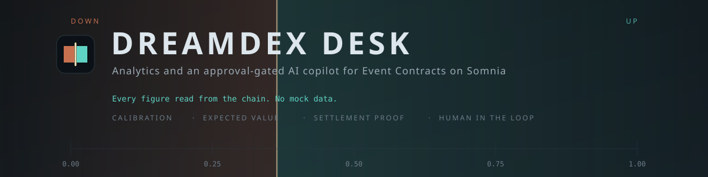
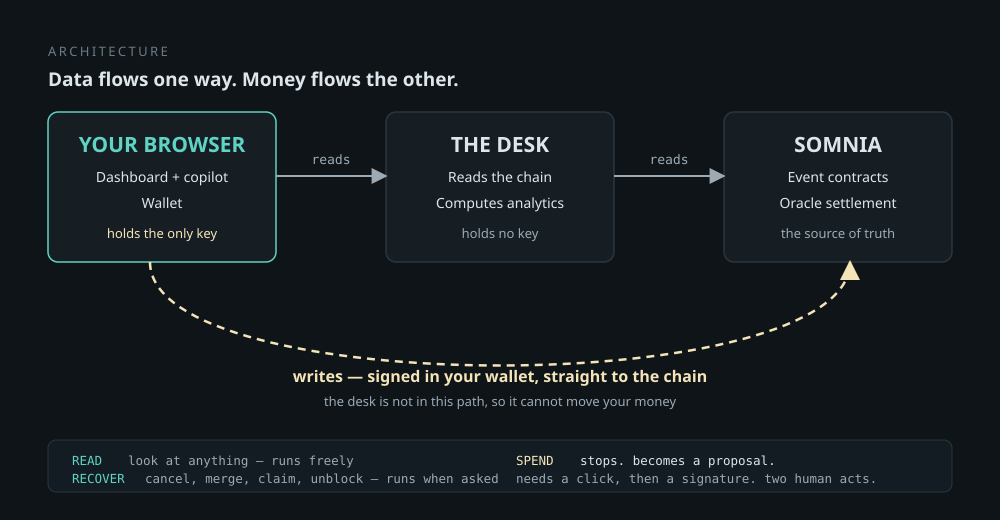

# DreamDEX Desk

**Somnia × DreamDEX Event Contracts Hackathon submission**

> **[Watch the 3-minute demo](#)** · **[Read the pitch deck](#)**
> *(add your links)*

An analytics terminal and an approval-gated AI copilot for **DreamDEX Event
Contracts** on Somnia. Every figure on screen is read from the chain — there is
no mock data anywhere in the application.

---

## The problem

An event contract asks one question: will BTC or ETH be at or above a line when
the window closes? Prices are probabilities between 0 and 1, a winning contract
pays exactly 1 USDC, and your stake is the most you can lose.

The official app lets you pick a side. It shows no volume, no history, no
portfolio, and no way to judge whether a price is any good. The documentation
says so itself:

> *"How much volume has a market traded? **It is not shown in the app yet**, but
> it is on-chain."*

So a trader faces three unanswerable questions:

| Question | Why it cannot be answered today |
| --- | --- |
| Is this price fair? | Nothing compares what markets predicted against what happened |
| When should I enter? | Nothing shows how a probability moves across a window |
| What am I owed? | Settled markets vanish from the market list, so unclaimed money is invisible |

## The solution

Event contracts settle on a schedule against a published oracle answer. Every
window therefore leaves behind a matched pair — **what the market predicted, and
what actually happened**. Nothing else in crypto hands you labelled outcomes at
that rate, and nobody is collecting them.

This desk collects them, and turns the result into a decision.

### What we found

Real calibration, computed from settled windows on the live Shannon venue. The
market is **under**confident in the middle bands:

| Band | Windows | Predicted | Actual | Gap |
| --- | --- | --- | --- | --- |
| 0.20 – 0.35 | 21 | 0.277 | 0.381 | **+10.4** |
| 0.35 – 0.50 | 11 | 0.410 | 0.545 | **+13.5** |
| 0.50 – 0.65 | 7 | 0.599 | 0.714 | **+11.5** |
| 0.65 – 0.80 | 17 | 0.729 | 0.824 | **+9.5** |

A contract pays 1 or 0, so the arithmetic is unusually clean: buy at price *p*
when the real chance is *q* and you earn *q − p* per contract, on average. The
desk does that for every open market and sizes a stake to match.

Two honesty notes, both enforced in code: bands under forty windows are labelled
**thin** rather than presented as findings, and stakes are quarter-Kelly capped
at 5% of the bankroll, because full Kelly assumes your probability is correct and
a measured curve has real error in it.

---

## Architecture



One idea, and it is the basis of the safety claim: **reads pass through the
server, writes do not.** Signing happens in the browser where the wallet lives,
so the desk has no key to lose and no path to your funds.

---

## How we used Somnia and DreamDEX

Event contracts are reachable **only** through `@somnia-chain/markets-sdk`. The
REST and WebSocket APIs cover spot and have no event-contract endpoints at all,
which shapes the whole application.

### Reads

| What | How |
| --- | --- |
| Live windows | `listBinaryMarkets`, venue-scoped, `orderBy: "newest"` |
| Resting depth | `getBinaryOrderBook` per pool |
| Calibration | `listBinaryMarkets({ status: "Finalized" })` — last price against `winningOutcome` |
| Probability path | `getCandles` at 60s across settled windows |
| Positions | `getPortfolio`, `getOutcomeBalances` on the shared ERC-6909 contract |
| On-chain truth | `getMarketOnchain` before every write |
| Settlement proof | `oracleQuestionId` deep-linked to the oracle explorer |

### Writes — the full trader surface

```
placeOrder   cancelOrder   cancelOrders   reduceOrder   amendOrder    redeem
mintSet      burnSet       faucet         pokeOracle    voidExpired   approveBuilder
```

Four are worth calling out, because nothing else surfaces them:

- **`mintSet` / `burnSet`** — one collateral mints one Up plus one Down. You can
  already quote *both sides* with no inventory, because two opposing buyers cross
  with no seller and the pool mints the pair from their combined collateral. What
  a complete set unlocks is **selling**: there is no naked short, so without one
  you can post bids and never an offer.
- **`amendOrder`** — cancel and replace atomically. As two transactions the quote
  is absent for a block or two, which on a fast tape is exactly when the fill
  arrives.
- **`pokeOracle` / `voidExpired`** — a market that expired without paying out can
  be pushed through by **anyone, for anyone**. Deliberate protocol design, so
  funds are never held behind one party's permission.
- **`approveBuilder`** — builder codes, the venue's revenue model. The docs only
  describe it for spot; the binary order path carries the same two fields.

### Somnia specifics that mattered

- **Reactivity** is why settlement needs no keeper. Measured median latency from
  expiry to resolution landing on-chain: **2 seconds**, void rate **0% across 189
  windows**.
- **Collateral decimals are 6 on Shannon and 18 on mainnet.** Everything is
  scaled from the market row rather than a constant — assuming either would
  misprice by a factor of a trillion.
- **Venue ids move.** Both networks have changed theirs repeatedly, so the desk
  discovers the venue at runtime by finding the one with live windows.

---

## Tech stack

| Layer | Choice | Why |
| --- | --- | --- |
| Framework | Next.js 16, App Router | Needs a server: the Azure key and indexer config must not reach the browser |
| Language | TypeScript, strict | The SDK is typed, raw units are `bigint`, and mistakes there are expensive |
| Chain | `@somnia-chain/markets-sdk` + viem | The only path to event contracts |
| Wallet | wagmi, injected connectors | Signing stays in the extension, and there is no project id to configure before seeing a number |
| AI | Azure OpenAI, gpt-4o, tool calling | Called only from a route handler |
| UI | shadcn/ui + Tailwind v4 | Components are copied into the repo, so they are ours to fix — and two needed it |
| State | `useSyncExternalStore` over shared stores | Several panels read the same data: one poll, one answer, everyone in step |

---

## The copilot in detail

Sixteen tools. It **draws** its answers rather than describing them, shows its
working, and cannot spend your money.

### 1. Generative UI

Ask *"is the market calibrated?"* and the curve renders inline — filled bar for
what happened, a marker for what was priced, sample size per band — with the
prose underneath. Six visual kinds: calibration, markets, edge, order book,
probability path, settlement receipts.

The **edge** visual is the one that acts: each row that clears the bar carries a
**Take N · X USDC** button, routed through the same proposal and approval as
everything else. Nothing bypasses the gate.

Every visual renders exactly what the tool returned, never re-derived — so what
you see cannot drift from what the copilot reasoned over.

### 2. The reasoning trail

Collapsed by default: *"Checked 2 sources · 4.7s"*. Expand it and each step shows
the tool called, a summary of what came back, and how long it took. Click a step
and the **arguments it passed** unfold as JSON.

An honest note: **gpt-4o emits no reasoning tokens** — that is a feature of
extended-thinking models. There is no hidden monologue to reveal, and a fake
"Thinking…" block would be theatre. What the model *does* emit is a line of
narration alongside each tool call saying what it is about to look up. That trail
is the reasoning, and it is captured rather than discarded.

### 3. Human in the loop

The safety model is one rule, and it lives in the **architecture** rather than
the prompt.

| Class | Examples | Behaviour |
| --- | --- | --- |
| **Read** | calibration, markets, book, portfolio | Runs freely. It only looks. |
| **Recover** | cancel, shrink, merge a set, unblock a settled market | Runs when asked. Worst case is gas spent on nothing. |
| **Spend** | place an order | **Stops.** Produces a proposal, never an order. |

A spending write reaches the chain only after **two deliberate human acts**:
pressing Approve, then signing in your own wallet. The model has no tool that can
sign, and the server holds no key.

The split is deliberate rather than lazy. Making the copilot ask before every
cancel would train you to click Approve without reading — exactly the habit the
approval card depends on you not having.

The approval card shows the tick-snapped price, cost, max loss, max gain, and
five checks: market still trading, enough time left, price on the tick grid,
balance covers it, depth supports the size.

### 4. Guardrails

Three layers, each doing what the one above cannot.

1. **A cheap pre-check.** *"tell me a joke"* is refused with zero tool calls and
   no model spend. Deliberately narrow, and an anchor word overrides it — so
   *"write me a summary of the calibration"* still runs, where a blunt keyword
   filter would have killed it.
2. **Prompt scope.** *"What is the capital of France?"* returns one sentence
   declining and naming what it does cover. No lecture.
3. **Explicitly in scope**, because a blunt filter gets these wrong: how a market
   mechanism works, and why a number on this dashboard says what it does.

The prompt also forbids inventing figures. A made-up number in an analytics tool
is worse than a gap, because the reader cannot tell the difference.

### 5. What it knows that you would otherwise learn the hard way

- Prices snap to the **integer tick grid** before a proposal is built. A float
  price passes quietly on 6-decimal Shannon and fails on **every** mainnet order.
- Markets close to expiry are refused, because a window can lock between the read
  and the send.
- Settled markets are queried the one way that actually finds unclaimed winnings.
  The ordinary market list cannot see them.

---

## The wallet — what it is for

**It says whose money you are looking at.** Positions are balances on a shared
ERC-6909 contract, so your book, your orders and your unclaimed winnings all need
an address.

**It signs.** Every write goes through it, one prompt each.

**The analytics half needs no wallet at all** — calibration, live markets, order
books, settlement receipts and void rates are venue-wide. Most of this project
can be evaluated without connecting anything.

---

## Running it

```bash
npm install
cp .env.example .env.local     # add your Azure OpenAI values
npm run dev
```

Open <http://localhost:3000>.

Only the copilot needs credentials. Every panel reads the chain with no
configuration at all — the venue is discovered at runtime.

---

## How to test every feature

Three tiers. Tier 1 needs nothing but the dev server.

### Tier 1 — no wallet required

| Page | What to check |
| --- | --- |
| `/` Markets | Live windows with real probabilities, spreads, and countdowns ticking each second. The order book shows real resting depth. |
| `/pricing` | **Where the edge is** — every open market priced against calibration. **Calibration** — the curve over real settled windows, gaps flagged. **Probability path** — where the eventual winner is cheapest. **Where the flow is** — real volume per series. |
| `/settlement` | **Void rate and latency** per series. **Settlement receipts** — click *sources* on any row to open the oracle's own record: every price feed, its value, the median. |
| Sidebar | Collapse it with the trigger; the icon rail stays usable. |
| Header | Toggle light and dark. |

**Copilot — also no wallet needed.** Open it bottom-right and try:

```
Is the market calibrated?              renders the curve inline
Where is the best edge right now?      rows with Take buttons
Why did the last markets resolve?      receipts with oracle links
Is there depth to fill 500 contracts?  chains two tools, reads the book
tell me a joke                         refused, zero tool calls
What is the capital of France?          declined in one sentence
```

Then expand **Checked N sources** under any answer, and click a step to see the
arguments it passed.

### Tier 2 — wallet connected, no funds

Connect an injected wallet on **Somnia Shannon** (chain 50312). On the wrong
network the button reads **Switch to Shannon**.

| Where | What to check |
| --- | --- |
| `/portfolio` | Your positions and unclaimed winnings, read from the chain. Empty is honest — it says so rather than showing a fake book. |
| `/` Working orders | Anything you have resting, with collateral locked |
| `/portfolio` Automation access | Paste any address as a bot key. It reads the registry and reports **not granted**. |

Ask the copilot **"what am I owed?"** — with a wallet connected it reads your
actual book.

### Tier 3 — funded wallet, real transactions

Two assets, in this order — minting collateral is itself a transaction, so gas
has to come first.

1. Click **Funds** in the header, copy your address.
2. Claim STT from the
   [Google Cloud faucet](https://cloud.google.com/application/web3/faucet/somnia/shannon)
   (the Shannon-specific path).
3. Back in the panel, **Refresh**, then **Mint 10,000 test USDC**.

Each action below raises one wallet prompt.

| Feature | Where | Expect |
| --- | --- | --- |
| Place a trade | `/` market row, **Up** / **Down** | Copilot opens with an approval card and five checks. Approve, then sign. |
| Take a measured edge | `/pricing`, **Take N** | Same card, sized at quarter-Kelly |
| Cancel an order | `/` Working orders, **Cancel** | Escrow returns to your wallet |
| Shrink an order | **Halve** | Size drops, queue position kept |
| Re-quote atomically | **Re-quote** | Moves one tick with no gap |
| Clear stale orders | **Cancel stale** | One transaction per pool, best-effort |
| Mint a complete set | `/` Complete sets, **Mint** | 10 collateral becomes 10 Up + 10 Down |
| Sell a side | **Offer UP / DOWN** | Post-only offer, only possible while holding a set |
| Merge back | **Merge back** | Pair returns to collateral |
| Claim winnings | `/portfolio`, **Claim all** | One signature per settled market |
| Unblock a market | `/settlement`, if any are stuck | Works on markets you do not hold |
| Delegate to a bot | `/portfolio`, **Grant trading rights** | Grants place, cancel and shrink on one market |
| Kill switch | **Revoke now** | Immediate; resting orders untouched |

**Verify the safety claim directly.** Ask the copilot to *"buy 20 UP on BTC"*. It
produces a proposal and stops. Press **Reject** and nothing is signed. There is no
path from model output to a transaction that does not pass through both a click
and a wallet prompt.

---

## What the chain does not expose

Stated rather than invented, because an analytics tool that fills gaps with
plausible numbers is worse than one that admits them.

- **How each fill crossed** — whether two buyers met or a real seller was involved
  lives in the fill events, not the market rows.
- **Per-source oracle detail** — on the oracle explorer. Every receipt links to it
  rather than restating it.
- **Unrealised P&L, and an order's distance from the touch** — both need a book
  read per position.

---

## Findings worth reporting upstream

Three, all verified against live Shannon rather than inferred:

1. **Operator delegation works on binary pools but is unreachable from the SDK.**
   Simulating `placeBinaryOrderFor`, `cancelOrderFor` and `reduceOrderFor` from an
   unauthorised caller all revert `OnlyApprovedContracts` — the pool asking the
   registry and being told no. But the registry address is absent from
   `SOMNIA_TESTNET_ADDRESSES`, the binary selector `0x5d97c566` is exported
   nowhere, and the grant helpers live under `dist/spot/` and reject it. The
   mechanism exists; the documented surface cannot reach it.
2. **The docs and the live venues disagree.** The documentation states there are
   no strike prices and only 15-minute and 1-hour windows. Live venues set strikes
   (`strike: "247023"`, *"will ETH/USDC be at or above 2470.23"*) and run 60s,
   300s, 900s, 3600s, 14400s and 86400s.
3. **The builder-fee cap is described inconsistently** across five places in the
   documentation — some say both networks run a 100000 cap, others that testnet is
   zero.

---

## Notes

- Shannon testnet only. Nothing here should point at real money yet.
- `.env.local` is gitignored. Never commit credentials.
- Built against the DreamDEX documentation, the `@somnia-chain/markets-sdk`
  package and its source, and the dreamBot Kit's event-contract guide. Where those
  disagreed with the chain, the chain won.
